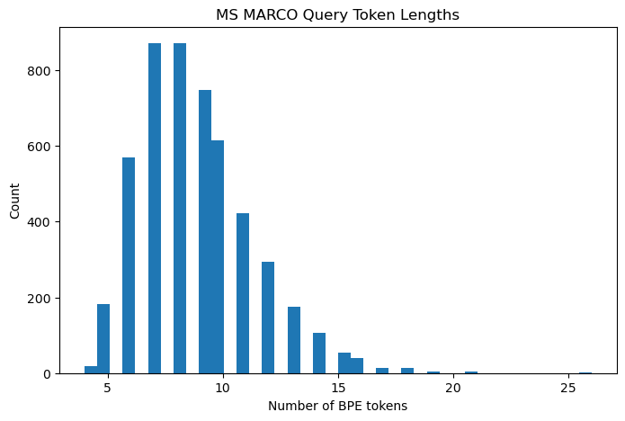
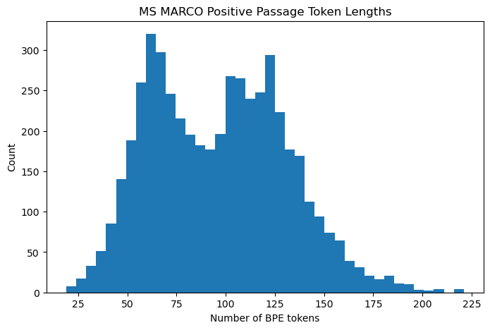
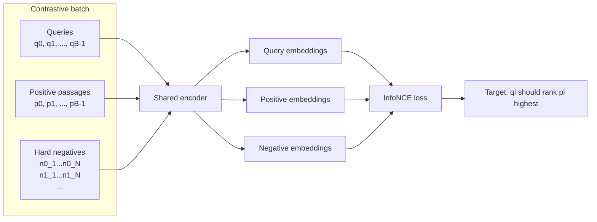
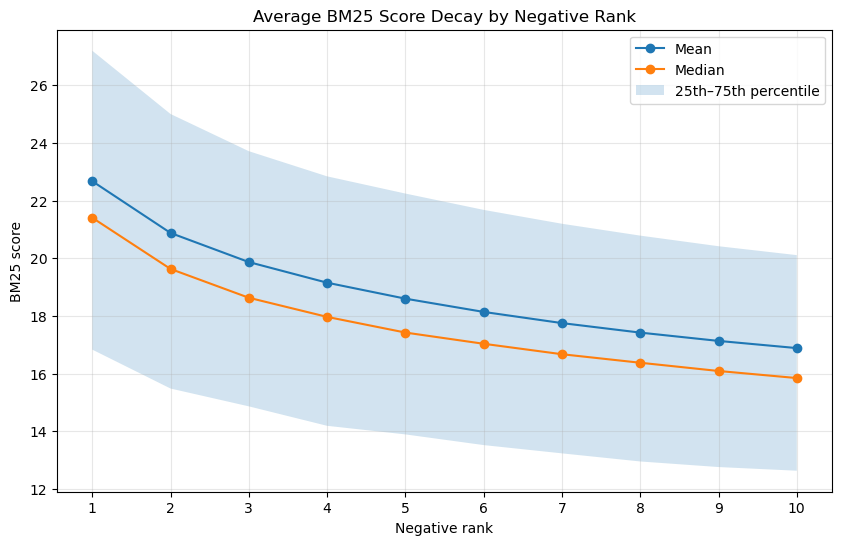
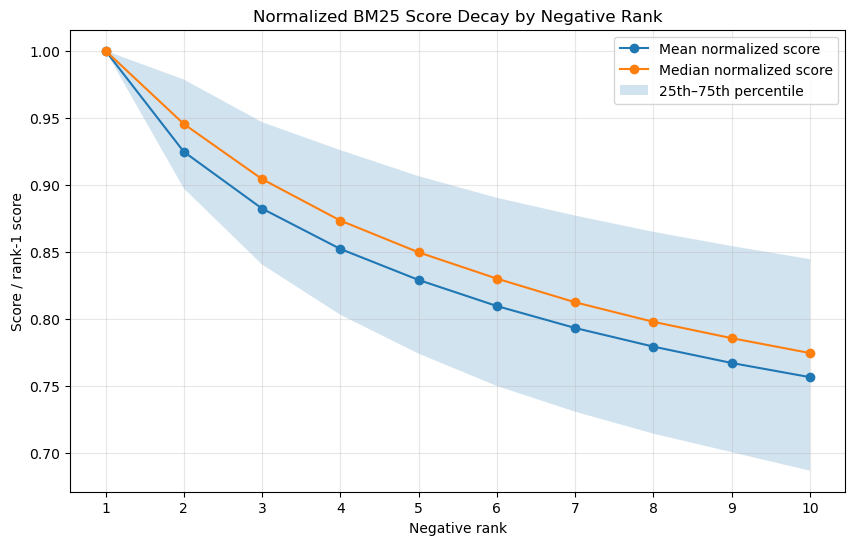
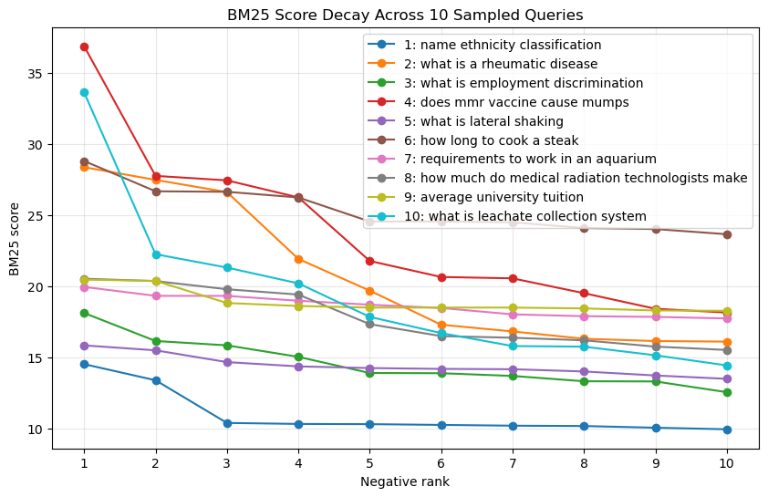

# Training Data, Contrastive Objective, and Hard-Negative Mining (Nikoloz Goguadze)

This section describes part of the project focused on the training-data and contrastive-learning pipeline for the neural search model. Since the final system is a dense retrieval system, the model needs to learn how to map a user query and a relevant passage into nearby embedding vectors. Work on this mainly centered around preparing specially selected query-passage data for that objective, implementing the contrastive loss used for training, and improving quality of chosen negative examples through BM25 assisted hard-negative and semi-hard-negative mining.

main components were:

- loading and parsing MS MARCO query-passage pairs
- building reusable JSONL dataset format for contrastive training
- generalizing the collator so it supports both in-batch only training as well as explicit hard negatives
- implementing InfoNCE loss to support both in-batch negatives and mined hard negatives
- mining BM25 hard-negative candidates from MS MARCO passages
- analyzing false-negative risk and creating semi-hard negative filtering strategies
- supporting the encoder pipeline with sinusoidal positional encoding

---

## MS MARCO as the Training Source

The final search engine is intended to retrieve relevant passages from the Jurafsky and Martin NLP textbook.  Since the textbook does not come with supervised query-passage relevance labels we needed an external retrieval dataset to teach the encoder general behavior of matching short information to relevant passages.

For this purpose, we used MS MARCO which is suitable for this kind of task because its examples are already structured around search-style queries and candidate passages. Each row contains query and a set of passages where some passages (usually just one) are marked as selected positives. These selected passages can be treated as relevant answers for the corresponding query.

The basic parsing pipeline was:

```text
MS MARCO row
→ query
→ candidate passages
→ selected positive passages
→ cleaned query-positive training pairs
```

For every row, we extracted the query and the passages where `is_selected == 1`. Each selected passage produced one training example of the form:

```text
(query, positive_passage)
```

This gave us basic supervised positive pairs for training the bi-encoder. Empty or invalid text was removed and text normalization was used for checking duplicate passages or exact positive matches during hard-negative mining.

MS MARCO is much larger than the amount of data we needed to inspect or mine at once, so the loader supports streaming mode. To avoid always taking the first rows in the original dataset order, the loader also supports streaming shuffle with a shuffle buffer.

During the initial data analysis, we loaded 5,000 MS MARCO query-positive pairs. This was used to check whether the extracted examples had the expected structure and whether the chosen token length limits were reasonable.  Analysis showed that queries were generally short, while positive passages were longer, which matches the expected retrieval setup. Query truncation at 64 tokens was 0% and passage truncation at 256 tokens was also 0% for inspected sample. Manual inspection of 20 random query-positive pairs showed that most selected passages were relevant to their queries.


|||
| ------------- | ------------- |
|  |  |

This sanity checking was important because the rest of the pipeline assumes that the extracted query-positive pairs are meaningful. If the positives were noisy or heavily truncated then contrastive loss would train the model on weak or incorrect supervision and everything would break down.

---

## Cached Contrastive Dataset Format

For repeated experiments, it is inefficient to repeatedly parse MS MARCO directly from HuggingFace. To make training and analysis easier we added a cached JSONL dataset format. Each line in the JSONL file stores one training example.

For simple in-batch negative training format is:

```json
{
  "query": "...",
  "positive_passage": "..."
}
```

For hard-negative training format is extended to:

```json
{
  "query": "...",
  "positive_passage": "...",
  "hard_negatives": ["...", "..."],
  "hard_negative_scores": [12.4, 10.7]
}
```

The final dataset loader, `ContrastiveJSONLDataset`, handles this cached format. This replaced the need for a separate hard-negative-specific dataset class as JSONL dataset can represent both ordinary query-positive pairs and query-positive pairs with mined hard negatives (both can be cached with appropriate cli scripts).

The older direct MS MARCO dataset path was still useful for quick testing the in-batch setup and for producing cached files, but the JSONL version became the final reusable interface for training.

---

## General Contrastive Collator

The collator converts raw text examples into tokenized tensors that can be passed into the encoder. Since the project uses a bi-encoder architecture, the query and passage are encoded separately so to accomodate this collator prepares separate token IDs and attention masks for the query and the positive passage.

For ordinary in-batch training batch contains:

```text
query_input_ids
query_attention_mask
pos_input_ids
pos_attention_mask
```

The collator was then generalized to support explicit hard negatives as well. If the input examples contain `hard_negatives` collator also produces:

```text
neg_input_ids
neg_attention_mask
```

Conceptually each query can have multiple hard negatives. This lets the same encoder process all negative passages in one forward pass and loss function can then interpret the resulting embeddings as explicit negatives for corresponding queries.



---

## Contrastive Learning Objective

The encoder is trained using a contrastive objective. Goal is to make the query embedding close to its relevant passage embedding and far from irrelevant passage embeddings.

For a batch of `B` query-positive pairs, let:

```text
Q = query embeddings
P = positive passage embeddings
```

The similarity matrix is computed as:

```text
Q @ P.T
```

This gives a `B × B` matrix. Row `i` contains the similarities between query `i` and every positive passage in the batch. The correct passage for query `i` is passage `i`, so the correct labels are simply on diagonal:

```text
[0, 1, 2, ..., B - 1]
```

| | `p0` | `p1` | `p2` | `...` | `pB-1` |
|---|---:|---:|---:|---:|---:|
| `q0` | target | negative | negative | ... | negative |
| `q1` | negative | target | negative | ... | negative |
| `q2` | negative | negative | target | ... | negative |
| `...` | ... | ... | ... | ... | ... |
| `qB-1` | negative | negative | negative | ... | target |


This is the in-batch InfoNCE setup. Each positive passage also acts as a negative for every other query in the batch. For example if the batch contains 64 query-positive pairs each query has one positive and 63 in-batch negatives.

The loss applies softmax over candidate passages for each query. The model is rewarded when the score for the correct query-passage pair is higher than scores for other passages. Temperature parameter controls how sharp the softmax distribution is. Lower temperatures make the model focus more strongly on ranking the correct passage above similar alternatives.

---

## Why InfoNCE Instead of Triplet Loss

We considered triplet loss and margin-based objectives but used InfoNCE for main training objective.

Triplet loss uses examples of the form:

```text
(query, positive, negative)
```

and tries to enforce that the positive is closer to the query than negative by some margin. This is intuitive, but it usually compares one positive against one negative at a time unless it is manually extended. That makes it less efficient for dense retrieval training where many candidate passages should compete against each other.

$$
L_{\text{triplet}} = \max(0,\; s(q, n) - s(q, p) + m)
$$

InfoNCE is more natural for our setup because it uses many negatives simultaneously. With in-batch negatives, a single batch of size `B` automatically creates `B × B` query-passage comparisons. This gives a stronger and more efficient learning signal than a single triplet comparison.

$$
L_i =
-\log
\frac{
\exp(s(q_i, p_i) / \tau)
}{
\sum_{j=1}^{B} \exp(s(q_i, p_j) / \tau)
}
$$

InfoNCE also extends cleanly to hard negatives:

$$
L_i =
-\log
\frac{
\exp(s(q_i, p_i) / \tau)
}{
\sum_{j=1}^{B} \exp(s(q_i, p_j) / \tau)
+
\sum_{k=1}^{N} \exp(s(q_i, n_{i,k}) / \tau)
}
$$

 while also being more robust in the sense of tolerating false-negative presence in the training set as we later observe to be a problem with MSMARCO. Mined negative passages can simply be added into the candidate set used by the softmax denominator. This means we can keep the same loss structure while making the negatives more challenging.

---

## Extension to Explicit Hard Negatives

The first version of the loss used only in-batch negatives,they can be too easy. Passages from unrelated queries may have very different topics so the model can separate them without learning specific relevance.

To make training more difficult and more useful the loss was extended to support explicit hard negatives whic are passages that are lexically or topically similar to the query but are not a selected positive passage. These negatives are more informative because the model has to distinguish between passages that look superficially relevant and passage that should actually be matched.

In hard-negative version, the candidate set for each batch contains:

```text
positive passages from the batch
+ mined hard-negative passages
```

The positive passages remain the first `B` candidates so the labels still point to the diagonal positions `[0, 1, ..., B - 1]`. The hard negatives are added as extra columns in the candidate matrix. Denominator of the InfoNCE softmax becomes larger and more difficult as the model must rank the correct positive above both the other positives in the batch and the explicit mined negatives.

| | `p0` | `p1` | `p2` | `n0_1` | `n0_2` | `n1_1` | `n1_2` | `n2_1` | `n2_2` |
|---|---:|---:|---:|---:|---:|---:|---:|---:|---:|
| `q0` | target | negative | negative | hard negative | hard negative | negative | negative | negative | negative |
| `q1` | negative | target | negative | negative | negative | hard negative | hard negative | negative | negative |
| `q2` | negative | negative | target | negative | negative | negative | negative | hard negative | hard negative |

This extension allowed the final training loop to train with semi-hard negatives rather than relying only on in-batch negatives.

---

## BM25 Hard-Negative Mining

To obtain hard negatives we used BM25. It is useful for hard-negative mining because it can retrieve passages that share important words with the query. These passages are usually much harder negatives than random passages.

The hard-negative mining process was:

```text
Build a BM25 corpus from MS MARCO candidate passages
For each query-positive pair:
    retrieve top-k BM25 passages for the query
    remove exact known positives
    remove duplicate passages
    keep the highest ranked remaining candidates as hard negatives
```

BM25 corpus was built from MS MARCO candidate passages. In the final mining run we used 6250 MS MARCO rows to build the candidate corpus which produced ~50,000 candidate passages. We then mined negatives for the available query-positive examples.

For each query we mined 10 BM25 candidate negatives starting from rank 0:

```powershell
python -m neural_search.cli.mine_hard_negatives `
  --max-examples 100000 `
  --max-corpus-rows 6250 `
  --num-negatives 10 `
  --retrieve-k 50 `
  --rank-start 0 `
  --shuffle-corpus `
  --progress-every 100 `
  --output data/cache/msmarco_semihard_candidates_top10.jsonl
```

This top-10 file was intentionally broader than the final number of negatives needed for training since goal was to create reusable candidate file that could later be sliced and filtered into different semi-hard datasets depending on the experiment.

extra information such as scores were kept as metadata so we could study how candidate difficulty changed across BM25 ranks and design better filtering strategies.

A key part of the miner was positive filtering. Since MS MARCO rows may contain selected positive passages, the miner removes exact known positives before keeping negatives. Text normalization is used and duplicate candidate passages are also filtered so the same negative does not appear multiple times for the same query.

---

## False-Negative Problem in Hard Negatives

BM25 hard negatives are useful but they introduce a risk, some mined "negatives" may actually be valid answers. This is called a false-negative problem.

MS MARCO selected passages are positive labels but non-selected passages are not guaranteed to be truly irrelevant, passage may answer the query even if it was not marked as selected positive.

Manual inspection confirmed this issue. Many mined candidates were close to the query which is exactly what we wanted from hard negatives, but some were close enough that they could answer the query. Treating these as negatives would give the model contradictory signals effectively training it to push away a passage that may actually be relevant. This result was further proved by worse performance in experiments compared to simple in-batch negatives.

Because of this, we did not want to blindly use only the top BM25 result as the negative. The highest ranked BM25 candidates are often the hardest but they are also the most likely to be false negatives.

---

## Semi-Hard Negative Filtering

To reduce false-negative risk, we used a semi-hard negative strategy.

To support this we mined wider top-10 candidate list for each query. This gave us flexibility to select different rank windows later. For example, instead of always using rank 1 we could skip the first few candidates and use ranks either 3-5 or 4-6. These later candidates are still BM25-relevant but they are somewhat less likely to be exact alternative answers.

We also analyzed BM25 score decay across the top-10 candidates. Since raw BM25 scores are not directly comparable across different queries normalized score ratios were more useful. The analysis showed that BM25 score decay was gradual rather than abrupt so later candidates in the top-10 list still retained a large fraction of the top candidate's BM25 score meaning they were still lexically related to the query and were not simply random easy negatives.

<table>
  <tr>
    <td width="50%">
      
      <br>
      <sub><b>(a)</b> Average BM25 score decay by negative rank.</sub>
    </td>
    <td width="50%">
      
      <br>
      <sub><b>(b)</b> Normalized BM25 score decay by negative rank.</sub>
    </td>
  </tr>
</table>

<details>
<summary>Additional per-query BM25 score decay plot</summary>

<p align="center">
  
</p>

<sub><b>(c)</b> BM25 score decay across 10 sampled queries. This plot shows that exact decay pattern differs by query though general trend remains visible.</sub>

</details>

This made the hard-negative pipeline more robust. Instead of assuming that BM25 rank 1 is always the best negative, this pipeline allowed controlled experiments with different negative difficulty levels and was ultimately used in the final training pipeline.

---

## Data Quality Observations

Several data-quality checks were important for validating the training pipeline.

First, MS MARCO query-positive pairs were inspected before training. Queries were usually short, which matches the behavior of real search queries. Positive passages were longer but still fit within the chosen passage length limit in the inspected sample.

Second, manual inspection showed that selected positive passages were mostly relevant to their queries.

Third, hard-negative examples were inspected manually. This showed that BM25 mining produced useful challenging candidates but also revealed the false-negative issue. This motivated the semi-hard negative strategy.

Finally, BM25 score analysis across top-10 candidates showed that later candidates were still meaningfully related to the query. This supported using rank-window slicing and score-based filtering as ways to balance difficulty and noise.

---

## Summary

This part of the project prepared the data and objective needed to train the dense retrieval model. MS MARCO was parsed into query-positive examples then cached into a reusable JSONL format and batched through generalized collator. InfoNCE was implemented for both in-batch negatives and explicit hard negatives allowing model to learn by ranking the correct passage above many competing passages.

BM25 was then used to mine hard-negative candidates. Since top BM25 negatives can sometimes be false negatives, especially in sparse MSMARCO Dataset, semi-hard negative strategy was implemented by mining top-10 candidate lists and enabling rank-window and/or score-based filtering. This made the negative data more flexible and safer for final training.

The result was a complete training-data and contrastive-learning pipeline that supported the final hard/semi-hard-negative training experiments for the neural search engine.
